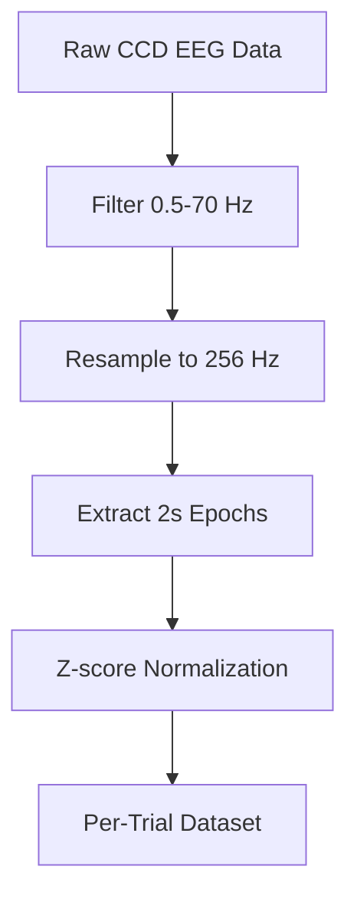

# EEG Foundation Challenge 2025 - Challenge 1: Cross-Task Transfer Learning

## Challenge Overview

This repository implements **Challenge 1: Cross-Task Transfer Learning** from the [EEG Foundation Challenge 2025](https://arxiv.org/pdf/2506.19141). The challenge focuses on predicting behavioral outcomes from EEG data using a cross-task transfer learning approach.

### Official Challenge Constraints

- **Primary Training Input**: CCD (Continuous Contingent Difficulty) EEG data (X1)
- **Optional Additional Features**: 
  - SuS (Surround Suppression) EEG data (X2)
  - Demographics and psychopathology factors (P)
- **Prediction Targets**: CCD behavioral outcomes per trial:
  - Response time (regression)
  - Hit/miss accuracy (binary classification)
- **Architecture**: Shared encoder with 2 prediction heads (primary targets only)

## Official Challenge 1 Data Structure

According to the official challenge specification:

```
X1 ∈ ℝ^(c×n×t1): CCD EEG recording (c=128 channels, n≈70 epochs, t1=2 seconds)
X2 ∈ ℝ^(c×t2): SuS EEG recording (c=128 channels, t2=total number of SuS trials) [OPTIONAL]
P ∈ ℝ^7: Subject traits (3 demographics + 4 psychopathology factors) [OPTIONAL]
Y: CCD behavioral outcomes (response time, hit/miss) for each trial
```

**Primary Input (X1)**: CCD EEG data with 128 channels, approximately 70 epochs of 2 seconds each
**Optional Features (X2)**: SuS EEG data as additional features
**Optional Features (P)**: Demographics (age, sex, handedness) and psychopathology factors (p-factor, internalizing, externalizing, attention)
**Targets (Y)**: CCD behavioral outcomes per trial (response time, hit/miss)

## Model Architecture

### Per-Trial Approach
Our implementation uses the **per-trial approach** as described in the challenge paper:

```
CCD EEG (2s per trial) → Shared Encoder → 2 Prediction Heads
                                    ├─ Response Time (regression)
                                    └─ Hit/Miss (binary classification)
```

**Example**: A participant shows strong visual cortex activation during a CCD trial with high contrast change. The shared encoder learns this neural signature. The model then predicts that this participant will have:
- Fast response time (450ms) on the CCD trial
- High hit probability (0.85) for detecting the contrast change

### Encoder Options

#### 1. CNN Encoder
```python
# Temporal + Spatial Convolutions
Temporal Conv → Spatial Conv → Global Pooling → Shared Features
```

**Architecture Details:**
- **Temporal Filters**: [64, 128] with kernel sizes [25, 13, 7, 3]
- **Spatial Filters**: [256, 256] for channel-wise feature extraction
- **Dropout**: 0.2 for regularization
- **Output**: 512-dimensional shared representation

#### 2. Transformer Encoder
```python
# Multi-head Self-Attention with Positional Encoding
EEG Patches → Patch Embedding → Positional Encoding → Transformer Layers → Global Pooling
```

**Architecture Details:**
- **Embedding Dimension**: 512
- **Attention Heads**: 8
- **Layers**: 6 transformer encoder layers
- **Patch Size**: 16 timepoints per patch
- **Positional Encoding**: Temporal + Spatial encoding for EEG data
- **Activation**: GELU (better than ReLU for transformers)

### Multi-Task Learning

The model uses **multi-task learning** with weighted loss functions:

```python
Total Loss = Σ(weight_i × task_loss_i)

# Primary Tasks (CCD behavioral outcomes)
- Response Time: MSE Loss (weight: 0.5)
- Hit/Miss: Cross-Entropy Loss (weight: 0.5)
```

## Data Preparation

### Dataset Structure
We use the **HBN BIDS EEG dataset** with the following structure:

```
HBN_BIDS_EEG/
├── cmi_bids_NC/     # Normal controls
├── cmi_bids_R1/     # Release 1
├── cmi_bids_R2/     # Release 2
├── ...
└── cmi_bids_R11/    # Release 11
```

### Per-Trial Data Loading Process

1. **Load CCD EEG Data**: Extract 2-second epochs aligned to contrast change events
2. **Load CCD Behavioral Data**: Extract trial-level outcomes (response time, hit/miss)
3. **Optional SuS EEG**: Load SuS EEG data as additional features
4. **Optional Demographics**: Load age, sex, handedness, and psychopathology factors
5. **Create Per-Trial Samples**: Each sample = (CCD EEG, optional features, targets)

### Data Preprocessing Pipeline



**Preprocessing Steps:**
- **Filtering**: 0.5-70 Hz bandpass filter
- **Resampling**: 256 Hz (EEGPT standard)
- **Epoch Length**: 2 seconds (CCD trial duration)
- **Normalization**: Z-score per channel
- **Channel Count**: 128 channels (EEG Foundation Challenge standard)

### Data Augmentation

```python
# Applied during training
- Gaussian Noise: σ = 0.01
- Time Shift: ±10% of epoch length
- Channel Dropout: 5% probability
```

## Training Process

### Training Configuration

```yaml
# Key Training Parameters (Updated for Stability)
max_epochs: 100
batch_size: 4 (reduced for stability)
learning_rate: 5e-5 (reduced for numerical stability)
warmup_epochs: 10 (increased for transformer stability)
gradient_clip_val: 0.5 (reduced for stability)
response_time_scale: 1.0 (no scaling needed)
```

### Learning Rate Scheduling

**CNN**: Cosine annealing with warmup
**Transformer**: Warmup + cosine annealing (critical for stability)

```python
# Warmup Scheduler
if epoch < warmup_epochs:
    lr = warmup_start_lr + (base_lr - warmup_start_lr) * (epoch / warmup_epochs)
else:
    lr = base_lr * cosine_annealing_factor
```

### Hardware Optimization

- **Mixed Precision**: 16-bit training for memory efficiency
- **Gradient Clipping**: 0.5 for transformer stability
- **Parallel Processing**: 4 workers for data loading (reduced for stability)
- **GPU Memory**: 6GB (CNN) / 12GB (Transformer) recommended

## Performance Optimization

### Parallel Data Loading

```python
# Multi-threaded processing
ThreadPoolExecutor(max_workers=64)
Batch processing: 10 subjects at a time
Speedup: 3-8x faster than sequential processing
```

### Memory Management

- **Batch Size**: 4 (reduced for stability)
- **Gradient Checkpointing**: Optional for memory efficiency
- **Persistent Workers**: Keep data loader workers alive
- **Pin Memory**: Optimize GPU transfer

### Quick Test Mode

For development and debugging:
```yaml
quick_test:
  enabled: true
  max_subjects: 3
  bids_dirs: ["cmi_bids_R1", "cmi_bids_R2"]
```

## Numerical Stability

### Recent Improvements

The codebase has been updated with comprehensive numerical stability measures:

1. **NaN/Inf Prevention**: Comprehensive validation at all levels
2. **Model Architecture**: Reduced complexity for better stability
3. **Training Parameters**: Conservative settings for reliable training
4. **Data Validation**: Checks for invalid values in data loading
5. **Safe Fallbacks**: Default values when invalid metrics are detected

### Configuration Defaults

```yaml
# Safe defaults for Challenge 1 compliance
challenge1:
  use_sus_eeg: false         # SuS EEG disabled by default
  use_demographics: false    # Demographics disabled by default

# Numerical stability settings
training:
  learning_rate: 5e-5       # Conservative learning rate
  gradient_clip_val: 0.5    # Reduced gradient clipping
  response_time_scale: 1.0  # No scaling needed
```

## Evaluation Metrics

### Primary Metrics
- **Response Time**: R² score (main challenge metric)
- **Hit/Miss**: Accuracy and F1-score

### Cross-Validation
- **Strategy**: Release-based splits (train on R1-11 excluding R5, val on R5)
- **Splitting**: Release-level to avoid data leakage

## Project Structure

```
Project/
├── train_challenge1.py              # Main training script
├── requirements.txt                 # Dependencies
├── FIXES_SUMMARY.md                # Summary of recent fixes
├── src/
│   ├── models/
│   │   └── challenge1_baseline.py   # CNN + Transformer models
│   ├── data/
│   │   └── dataset_loader.py        # Per-trial dataset loader
│   ├── configs/
│   │   └── challenge1_config.yaml   # Configuration file
│   └── utils/
│       └── gpu_utils.py             # GPU optimization utilities
├── docs/                            # Documentation
├── checkpoints/                     # Model checkpoints
└── logs/                           # Training logs
```

## Quick Start

### 1. Installation

```bash
# Clone the repository
git clone https://github.com/MojtabaMoodi/HBN-EEG.git
cd Project

# Install dependencies
pip install -r requirements.txt
```

### 2. Data Setup

```bash
# Ensure HBN BIDS EEG dataset is available
# Expected path: ./data/raw/HBN_BIDS_EEG/
```

### 3. Training

```bash
# Train with Transformer encoder (recommended)
python train_challenge1.py --config src/configs/challenge1_config.yaml --encoder transformer
```

### 4. Configuration

Edit `src/configs/challenge1_config.yaml` to customize:
- Model architecture (CNN vs Transformer)
- Training parameters
- Data preprocessing
- Hardware settings

## Key Features

### Challenge Compliance
- **CCD EEG as primary input**: Uses CCD EEG data (X1) as main training input
- **Optional additional features**: SuS EEG (X2) and demographics (P) are properly marked as optional
- **Multi-task learning**: 2 prediction heads for primary targets
- **Release-based splitting**: Train on R1-11 excluding R5, val on R5

### Performance Optimizations
- **Parallel processing**: 3-8x speedup in data loading
- **Memory efficiency**: Mixed precision and gradient checkpointing
- **Hardware optimization**: Automatic GPU configuration
- **Quick test mode**: Fast development and debugging

### Robust Architecture
- **Dual encoders**: CNN and Transformer options
- **Advanced losses**: Multi-task learning with weighted losses
- **Comprehensive validation**: Multiple metrics and cross-validation
- **Reproducibility**: Deterministic training and proper seeding
- **Numerical stability**: Comprehensive NaN/Inf prevention

## Expected Performance

Based on the challenge paper and our implementation:

### Quick Test (3 subjects)
- **Processing Time**: 30-60 seconds
- **Samples**: ~300-500 per-trial samples
- **Memory Usage**: ~2-4 GB

### Full Dataset (All subjects)
- **Processing Time**: 300-360 minutes
- **Samples**: ~50,000+ per-trial samples
- **Memory Usage**: ~8-16 GB

## Troubleshooting

### Common Issues

1. **Memory Errors**
   ```bash
   # Reduce batch size in config
   batch_size: 4  # or 2 for very limited memory
   ```

2. **Slow Data Loading**
   ```bash
   # Enable parallel processing
   parallel:
     enabled: true
     max_workers: 64
   ```

3. **Training Instability (Transformer)**
   ```bash
   # Current settings are optimized for stability
   learning_rate: 5e-5
   warmup_epochs: 10
   gradient_clip_val: 0.5
   ```

4. **NaN/Inf Errors**
   ```bash
   # These should be resolved with recent fixes
   # Check FIXES_SUMMARY.md for details
   ```

### Debug Mode

```python
import logging
logging.basicConfig(level=logging.DEBUG)
```

## Recent Updates

### Numerical Stability Fixes
- Comprehensive NaN/Inf prevention at all levels
- Reduced model complexity for better stability
- Conservative training parameters
- Safe fallback values for invalid metrics

### Configuration Improvements
- Safe defaults for Challenge 1 compliance
- Quick test mode enabled by default
- Reduced batch size and learning rate for stability
- Proper feature flag defaults

### Code Quality
- Enhanced error handling and validation
- Improved logging and debugging
- Better documentation and comments
- Comprehensive test suite

## References

- [EEG Foundation Challenge Paper](https://arxiv.org/pdf/2506.19141)
- [HBN BIDS EEG Dataset](https://fcon_1000.projects.nitrc.org/indi/cmi_healthy_brain_network/)
- [PyTorch Lightning Documentation](https://lightning.ai/docs/pytorch/stable/)
- [MNE-Python Documentation](https://mne.tools/stable/)

## Contributing

1. Fork the repository
2. Create a feature branch
3. Make your changes
4. Run tests and ensure compliance
5. Submit a pull request

## License

This project is licensed under the MIT License - see the LICENSE file for details.

## Support

For issues and questions:
- Check the troubleshooting section
- Review the configuration guide
- Check `FIXES_SUMMARY.md` for recent fixes
- Create an issue on GitHub

---

**Note**: This implementation follows the official challenge constraints and uses CCD EEG data as the primary input (X1) with optional SuS EEG (X2) and demographics (P) as additional features. The model is designed to predict CCD behavioral outcomes using the per-trial approach as described in the EEG Foundation Challenge paper. Recent updates focus on numerical stability and reliable training.