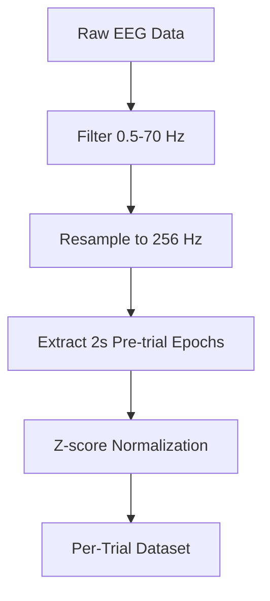

# EEG Foundation Challenge 2025 - Challenge 1: Cross-Task Transfer Learning

## Challenge Overview

This repository implements **Challenge 1: Cross-Task Transfer Learning** from the [EEG Foundation Challenge 2025](https://arxiv.org/pdf/2506.19141). The challenge focuses on predicting behavioral outcomes from EEG data using a cross-task transfer learning approach.

### Official Challenge Constraints

- **Training Input**: ONLY SuS (Surround Suppression) EEG epochs
- **Prediction Targets**: CCD (Continuous Contingent Difficulty) behavioral outcomes per trial:
  - Response time (regression)
  - Hit/miss accuracy (binary classification)
  - Age (auxiliary regression)
  - Sex (auxiliary classification)
- **Constraint**: CCD EEG data is NOT provided and NOT allowed for training
- **Architecture**: Shared encoder with 4 prediction heads

## Model Architecture

### Per-Trial Approach
Our implementation uses the **per-trial approach** as described in the challenge paper:

```
SuS EEG (2s pre-trial) → Shared Encoder → 4 Prediction Heads
                                    ├─ Response Time (regression)
                                    ├─ Hit/Miss (binary classification)
                                    ├─ Age (regression)
                                    └─ Sex (classification)
```

**Example**: A participant shows strong visual cortex activation during a SuS trial with high contrast suppression. The shared encoder learns this neural signature. The model then predicts that this participant will have:
- Fast response time (450ms) on the corresponding CCD trial
- High hit probability (0.85) for detecting the contrast change
- Estimated age (16.2 years) and sex (female) from auxiliary heads

### Encoder Options

#### 1. CNN Encoder
```python
# Temporal + Spatial Convolutions
Temporal Conv → Spatial Conv → Global Pooling → Shared Features
```

**Architecture Details:**
- **Temporal Filters**: [64, 128] with kernel sizes [25, 13, 7, 3]
- **Spatial Filters**: [256, 256] for channel-wise feature extraction
- **Dropout**: 0.2 for regularization
- **Output**: 512-dimensional shared representation

#### 2. Transformer Encoder
```python
# Multi-head Self-Attention with Positional Encoding
EEG Patches → Patch Embedding → Positional Encoding → Transformer Layers → Global Pooling
```

**Architecture Details:**
- **Embedding Dimension**: 512
- **Attention Heads**: 8
- **Layers**: 6 transformer encoder layers
- **Patch Size**: 16 timepoints per patch
- **Positional Encoding**: Temporal + Spatial encoding for EEG data
- **Activation**: GELU (better than ReLU for transformers)

### Multi-Task Learning

The model uses **multi-task learning** with weighted loss functions:

```python
Total Loss = Σ(weight_i × task_loss_i) + auxiliary_losses

# Primary Tasks (CCD behavioral outcomes)
- Response Time: MSE Loss (weight: 0.4)
- Hit/Miss: Cross-Entropy Loss (weight: 0.4)

# Auxiliary Tasks (demographics)
- Age: MSE Loss (weight: 0.1)
- Sex: Cross-Entropy Loss (weight: 0.1)

# Auxiliary Losses (for better learning)
- Sparsity Loss: L1 regularization on head weights
- Task Vector Loss: Encourages different learning directions
- Gradient Conflict Loss: Mitigates conflicting gradients
```

## Data Preparation

### Dataset Structure
We use the **HBN BIDS EEG dataset** with the following structure:

```
HBN_BIDS_EEG/
├── cmi_bids_NC/     # Normal controls
├── cmi_bids_R1/     # Release 1
├── cmi_bids_R2/     # Release 2
├── ...
└── cmi_bids_R9/     # Release 9
```

### Per-Trial Matching Process

1. **Load SuS EEG Data**: Extract 2-second pre-trial epochs
2. **Load CCD Behavioral Data**: Extract trial-level outcomes
3. **Temporal Alignment**: Match SuS epochs with CCD contrast change times
4. **Create Per-Trial Samples**: Each sample = (SuS EEG, CCD outcomes)

### Data Preprocessing Pipeline



**Preprocessing Steps:**
- **Filtering**: 0.5-70 Hz bandpass filter
- **Resampling**: 256 Hz (EEGPT standard)
- **Epoch Length**: 2 seconds (pre-trial duration)
- **Normalization**: Z-score per channel

### Data Augmentation

```python
# Applied during training
- Gaussian Noise: σ = 0.01
- Time Shift: ±10% of epoch length
- Channel Dropout: 5% probability
```

## Training Process

### Training Configuration

```yaml
# Key Training Parameters
max_epochs: 80
batch_size: 32 (CNN) / 16 (Transformer)
learning_rate: 1e-3 (CNN) / 5e-4 (Transformer)
warmup_epochs: 5 (CNN) / 10 (Transformer)
```

### Learning Rate Scheduling

**CNN**: Cosine annealing with warmup
**Transformer**: Warmup + cosine annealing (critical for stability)

```python
# Warmup Scheduler
if epoch < warmup_epochs:
    lr = warmup_start_lr + (base_lr - warmup_start_lr) * (epoch / warmup_epochs)
else:
    lr = base_lr * cosine_annealing_factor
```

### Hardware Optimization

- **Mixed Precision**: 16-bit training for memory efficiency
- **Gradient Clipping**: 1.0 for transformer stability
- **Parallel Processing**: 64 workers for data loading
- **GPU Memory**: 6GB (CNN) / 12GB (Transformer) recommended

## Performance Optimization

### Parallel Data Loading

```python
# Multi-threaded processing
ThreadPoolExecutor(max_workers=64)
Batch processing: 10 subjects at a time
Speedup: 3-8x faster than sequential processing
```

### Memory Management

- **Batch Size**: Adaptive based on GPU memory
- **Gradient Checkpointing**: Optional for memory efficiency
- **Persistent Workers**: Keep data loader workers alive
- **Pin Memory**: Optimize GPU transfer

### Quick Test Mode

For development and debugging:
```python
quick_test:
  enabled: true
  max_subjects: 5
  bids_dirs: ["cmi_bids_R1"]
```

## Evaluation Metrics

### Primary Metrics
- **Response Time**: R² score (main challenge metric)
- **Hit/Miss**: Accuracy and F1-score

### Secondary Metrics
- **Age**: R² score
- **Sex**: Accuracy

### Cross-Validation
- **Strategy**: Subject-stratified 5-fold CV
- **Splitting**: Subject-level to avoid data leakage

## 📁 Project Structure

```
Project/
├── train_challenge1.py              # Main training script
├── requirements.txt                 # Dependencies
├── src/
│   ├── models/
│   │   └── challenge1_baseline.py   # CNN + Transformer models
│   ├── data/
│   │   └── dataset_loader.py        # Per-trial dataset loader
│   ├── configs/
│   │   └── challenge1_config.yaml   # Configuration file
│   └── utils/
│       └── gpu_utils.py             # GPU optimization utilities
├── docs/                            # Documentation
├── checkpoints/                     # Model checkpoints
└── logs/                           # Training logs
```

## Quick Start

### 1. Installation

```bash
# Clone the repository
git clone https://github.com/MojtabaMoodi/HBN-EEG.git
cd Project

# Install dependencies
pip install -r requirements.txt
```

### 2. Data Setup

```bash
# Ensure HBN BIDS EEG dataset is available
# Expected path: ./data/raw/HBN_BIDS_EEG/
```

### 3. Training

```bash
# Train with Transformer encoder (recommended)
python train_challenge1.py --config src/configs/challenge1_config.yaml --encoder transformer

# Train with CNN encoder
python train_challenge1.py --encoder cnn

# Quick test mode
python train_challenge1.py --quick-test
```

### 4. Configuration

Edit `src/configs/challenge1_config.yaml` to customize:
- Model architecture (CNN vs Transformer)
- Training parameters
- Data preprocessing
- Hardware settings

## Key Features

### Challenge Compliance
- **Per-trial approach**: Matches SuS EEG with CCD behavioral outcomes
- **No CCD EEG usage**: Only SuS EEG for training
- **Multi-task learning**: 4 prediction heads as required
- **Subject-level splitting**: Prevents data leakage

### Performance Optimizations
- **Parallel processing**: 3-8x speedup in data loading
- **Memory efficiency**: Mixed precision and gradient checkpointing
- **Hardware optimization**: Automatic GPU configuration
- **Quick test mode**: Fast development and debugging

### Robust Architecture
- **Dual encoders**: CNN and Transformer options
- **Advanced losses**: Sparsity, task vectors, gradient conflicts
- **Comprehensive validation**: Multiple metrics and cross-validation
- **Reproducibility**: Deterministic training and proper seeding

## Expected Performance

Based on the challenge paper and our implementation:

### Quick Test (5 subjects)
- **Processing Time**: 30-60 seconds
- **Samples**: ~300-500 per-trial samples
- **Memory Usage**: ~2-4 GB

### Full Dataset (All subjects)
- **Processing Time**: 300-360 minutes
- **Samples**: ~50,000+ per-trial samples
- **Memory Usage**: ~8-16 GB

## Troubleshooting

### Common Issues

1. **Memory Errors**
   ```bash
   # Reduce batch size in config
   batch_size: 16  # or 8 for very limited memory
   ```

2. **Slow Data Loading**
   ```bash
   # Enable parallel processing
   parallel:
     enabled: true
     max_workers: 64
   ```

3. **Training Instability (Transformer)**
   ```bash
   # Reduce learning rate and increase warmup
   learning_rate: 5e-4
   warmup_epochs: 10
   gradient_clip_val: 1.0
   ```

### Debug Mode

```python
import logging
logging.basicConfig(level=logging.DEBUG)
```

## References

- [EEG Foundation Challenge Paper](https://arxiv.org/pdf/2506.19141)
- [HBN BIDS EEG Dataset](https://fcon_1000.projects.nitrc.org/indi/cmi_healthy_brain_network/)
- [PyTorch Lightning Documentation](https://lightning.ai/docs/pytorch/stable/)
- [MNE-Python Documentation](https://mne.tools/stable/)

## Contributing

1. Fork the repository
2. Create a feature branch
3. Make your changes
4. Run tests and ensure compliance
5. Submit a pull request

## License

This project is licensed under the MIT License - see the LICENSE file for details.

## Support

For issues and questions:
- Check the troubleshooting section
- Review the configuration guide
- Create an issue on GitHub

---

**Note**: This implementation follows the official challenge constraints and uses the per-trial approach as described in the EEG Foundation Challenge paper. The model is designed to predict CCD behavioral outcomes using only SuS EEG data, demonstrating cross-task transfer learning capabilities.