# EEG Foundation Challenge: EEGPT-Style Foundation Model

## Overview
This project implements a comprehensive foundation model for the 2025 EEG Foundation Challenge using EEGPT-style patch-based tokenization. Our approach treats EEG signals like vision transformers treat images, converting continuous neural signals into discrete temporal patches for transformer-based processing.

## 🎯 Challenge Overview

### **Challenge 1: Cross-Task Transfer Learning**
- **Source Domain**: Surround Suppression task (passive visual task)
- **Target Domain**: Contrast Change Detection task (active attention task)
- **Goal**: Train foundation model on SuS, then fine-tune/evaluate on CCD performance
- **Metric**: Behavioral performance correlation

**Detailed Explanation**: This challenge tests the ability to transfer learned neural representations across different cognitive tasks. The foundation model learns from the Surround Suppression (SuS) task, where participants passively view visual stimuli with varying levels of center-surround contrast suppression. The model must then predict performance on the Contrast Change Detection (CCD) task, where participants actively attend to and detect changes in visual contrast.

**Example**: Consider a participant who shows strong gamma-band activity (30-100Hz) in visual cortex during SuS trials with high contrast suppression. The foundation model learns that this neural signature correlates with efficient visual processing. When applied to CCD data, the model predicts that participants with similar gamma patterns will have faster reaction times and higher accuracy in detecting contrast changes, even though CCD requires active attention while SuS is passive viewing.

```python
# Example data flow
sus_eeg = load_eeg_data(subject_id="S001", task="surroundSupp")  # Shape: (129, 128000)
sus_tokens = tokenizer.tokenize(sus_eeg)  # Shape: (500, 129, 64)
sus_features = foundation_model.encode(sus_tokens)  # Shape: (500, 512)

# Transfer to CCD task
ccd_eeg = load_eeg_data(subject_id="S001", task="contrastChangeDetection")
ccd_performance = foundation_model.predict_performance(ccd_eeg)  # Scalar: 0.85 (85% accuracy)
```

### **Challenge 2: Psychopathology Prediction**
- **Input**: EEG signals from multiple tasks (passive + active)
- **Targets**: 4 psychological factors:
  - `p_factor`: General psychopathology factor
  - `attention`: Attention problems
  - `internalizing`: Anxiety, depression symptoms
  - `externalizing`: Aggression, rule-breaking behavior
- **Approach**: Multi-task regression from EEG features

**Detailed Explanation**: This challenge focuses on predicting dimensional measures of psychopathology from EEG biomarkers. The model analyzes neural activity patterns across multiple cognitive tasks to identify signatures associated with different aspects of mental health. Unlike traditional categorical diagnosis, this approach captures the continuous nature of psychological symptoms and their underlying neural mechanisms.

**Example**: A participant shows elevated frontal theta activity (4-8Hz) during resting state, reduced alpha suppression (8-12Hz) during attention tasks, and increased beta activity (13-30Hz) during emotional processing. The model learns that this pattern typically corresponds to:
- `p_factor`: 2.3 (elevated general psychopathology)
- `attention`: 1.8 (moderate attention difficulties)  
- `internalizing`: 2.7 (high anxiety/depression symptoms)
- `externalizing`: 0.9 (low aggression/rule-breaking)

```python
# Example multi-task prediction
multi_task_eeg = {
    'rest': load_eeg_data(subject_id="S001", task="RestingState"),
    'nback': load_eeg_data(subject_id="S001", task="nback"),
    'emotion': load_eeg_data(subject_id="S001", task="DespicableMe")
}

# Extract features from all tasks
features = foundation_model.extract_features(multi_task_eeg)

# Predict psychological factors
predictions = foundation_model.predict_psychopathology(features)
# Output: {'p_factor': 2.3, 'attention': 1.8, 'internalizing': 2.7, 'externalizing': 0.9}
```

**Clinical Relevance**: These neural-based predictions can inform personalized treatment approaches, early intervention strategies, and our understanding of how different psychological symptoms manifest in brain activity patterns. The dimensional approach aligns with modern frameworks like the Research Domain Criteria (RDoC) that emphasize biological markers of mental health.

## 🏗️ System Architecture

### Data Processing Pipeline

```mermaid
graph TD
    A["Raw HBN EEG Data<br/>129 channels, 500Hz<br/>Multiple tasks"] --> B["EEGPTTokenizer<br/>Preprocessing Pipeline"]
    
    B --> C["1. Bandpass Filter<br/>0.5-70 Hz"]
    C --> D["2. Resample<br/>500Hz → 256Hz"]
    D --> E["3. Channel Alignment<br/>All 129 channels (E1-E128, Cz)"]
    E --> F["4. Patch Creation<br/>64 samples × 129 channels"]
    F --> G["5. Layer Normalization<br/>Per-patch normalization"]
    
    G --> H["Tokenized EEG Patches<br/>Shape: (n_patches, 129, 64)"]
    
    H --> I["Foundation Model<br/>Transformer Encoder"]
    I --> J["Challenge 1: Cross-task<br/>SuS → CCD Transfer"]
    I --> K["Challenge 2: Psychopathology<br/>4-factor prediction"]
    
    L["Dataset Loader<br/>HBN BIDS format"] --> A
    
    M["Configuration System<br/>YAML configs"] --> B
    M --> I
    
    style A fill:#e1f5fe
    style H fill:#f3e5f5
    style I fill:#fff3e0
    style J fill:#e8f5e8
    style K fill:#e8f5e8
```



### Model Architecture


## 📊 Dataset Analysis

### HBN Dataset Statistics
- **Total subjects**: 2,639 across 10 releases (cmi_bids_NC, cmi_bids_R1-R9)
- **Channels**: 129 EEG channels (EGI HydroCel GSN 128 + Cz)
- **Original sampling rate**: 500Hz → 256Hz (resampled)
- **Channel layout**: E1-E128 + Cz (all EEG type)

### Task Distribution
- **Surround Suppression**: 2,112 subjects (Challenge 1 source)
- **Contrast Change Detection**: 1,765 subjects (Challenge 1 target)
- **Passive tasks**: RestingState, movies (DespicableMe, FunwithFractals, etc.)
- **Active tasks**: symbolSearch, seqLearning variants

### EEG Signal Characteristics
- **Value range**: [-0.07, 0.14] (float64)
- **Preprocessing**: 0.5-70Hz bandpass, 256Hz resampling
- **Tokenization**: 64-sample patches (0.25s windows)

## 🔧 Technical Implementation

### 1. EEGPT-Style Tokenization

Our core innovation is implementing EEGPT's patch-based tokenization for the full 129-channel HBN dataset:

```python
class EEGPTTokenizer:
    def __init__(self, patch_size=64, target_sfreq=256, use_all_channels=True):
        self.patch_size = 64        # 0.25s at 256Hz
        self.target_sfreq = 256     # EEGPT standard
        self.use_all_channels = True # All 129 HBN channels
        
    def tokenize(self, eeg_data):
        # Convert: (n_channels, n_samples) → (n_patches, n_channels, patch_size)
        # Apply per-patch layer normalization (EEGPT standard)
        return tokenized_patches
```

**Tokenizer Variants:**
- `standard`: 64-sample patches, no overlap, all channels
- `hbn`: Optimized for HBN's 129-channel layout  
- `hbn_foundation`: 50% overlap for richer training data
- `eegpt_original`: Original 62 EEGPT channels for comparison

### 2. Foundation Model Architecture

```python
class EEGFoundationModel(pl.LightningModule):
    def __init__(self, backbone='simple', challenge_type='cross_task'):
        # Flexible backbone selection
        self.backbone = self._create_backbone()  # CNN or Transformer
        
        # Multi-task prediction heads
        if challenge_type == 'cross_task':
            self.task_heads['performance'] = LinearHead(1)
        elif challenge_type == 'psychopathology':
            self.task_heads['p_factor'] = LinearHead(1)
            self.task_heads['attention'] = LinearHead(1) 
            self.task_heads['internalizing'] = LinearHead(1)
            self.task_heads['externalizing'] = LinearHead(1)
        
        # Auxiliary tasks for representation learning
        self.task_heads['age'] = LinearHead(1)
        self.task_heads['sex'] = LinearHead(2)
```

### 3. Training Strategy

**Multi-Task Learning with Weighted Loss:**
```python
def compute_loss(self, outputs, labels):
    loss = (
        α₁ * mse_loss(pred_p_factor, true_p_factor) +
        α₂ * mse_loss(pred_attention, true_attention) +
        α₃ * mse_loss(pred_internal, true_internal) +
        α₄ * mse_loss(pred_external, true_external) +
        β₁ * mse_loss(pred_age, true_age) +
        β₂ * ce_loss(pred_sex, true_sex)
    )
    return loss
```

## 📁 Project Structure

```
Project/
├── 📄 README.md                    # This comprehensive documentation
├── 📁 src/
│   ├── 📁 data/
│   │   ├── 📄 eegpt_tokenizer.py   # EEGPT-style patch tokenization
│   │   ├── 📄 dataset_loader.py    # HBN dataset handling & preprocessing
│   │   ├── 📄 quantization_utils.py # Alternative quantization methods
│   │   └── 📄 data_explorer.py     # Dataset analysis utilities
│   ├── 📁 models/
│   │   ├── 📄 foundation_model.py  # Main foundation model
│   │   ├── 📄 challenge1_baseline.py # Cross-task baseline
│   │   └── 📄 test_model.py        # Model testing utilities
│   ├── 📁 training/                # Training scripts
│   ├── 📁 evaluation/              # Evaluation metrics
│   └── 📁 utils/                   # General utilities
├── 📁 configs/
│   ├── 📄 dataset_config.yaml      # Dataset configuration
│   └── 📄 model_config.yaml        # Model configuration
├── 📁 docs/
│   ├── 📄 MODEL_ARCHITECTURE.md    # Detailed model documentation
│   └── 📄 CONFIGURATION_GUIDE.md   # Configuration guide
├── 📁 data/                        # Processed data cache
│   ├── 📁 raw/                     # Raw HBN-EEG data (symlinked)
│   ├── 📁 processed/               # Preprocessed data
│   └── 📁 features/                # Extracted features
├── 📁 experiments/                 # Experiment scripts
├── 📁 notebooks/                   # Exploratory analysis
├── 📁 results/                     # Experiment results
└── 📄 requirements.txt             # Python dependencies
```

## 🚀 Key Innovations

1. **Full Channel Utilization**: Unlike EEGPT's 64 channels, we use all 129 HBN channels (E1-E128 + Cz)
2. **EEGPT-Style Tokenization**: First application of patch-based tokenization to HBN's high-density EEG
3. **Multi-Challenge Architecture**: Single foundation model handles both transfer learning and psychopathology prediction
4. **Flexible Backbone Support**: Compatible with BENDR, EEGPT, and custom architectures
5. **Comprehensive Preprocessing**: EEGPT-standard pipeline optimized for HBN data characteristics

## 🔬 Preprocessing Pipeline

### Signal Processing Steps:
1. **Quality Control**: Handle boundary events and data discontinuities
2. **Filtering**: 0.5-70 Hz bandpass (EEGPT standard)
3. **Resampling**: 500Hz → 256Hz for computational efficiency
4. **Channel Standardization**: Preserve all 129 channels with consistent naming
5. **Patch Creation**: 64-sample temporal windows (0.25s duration)
6. **Normalization**: Per-patch layer normalization following EEGPT

### Tokenization Output:
- **Shape**: `(n_patches, 129, 64)`
- **Patch overlap**: Configurable (0%, 50% for foundation training)
- **Temporal resolution**: 0.25s per patch at 256Hz
- **Spatial resolution**: Full 129-channel coverage

## 🎯 Challenge-Specific Approaches

### Challenge 1: Cross-Task Transfer
```python
# Phase 1: Foundation training on Surround Suppression
model.fit(sus_eeg_data, sus_behavioral_performance)

# Phase 2: Transfer to Contrast Change Detection  
model.freeze_backbone()  # Freeze learned EEG representations
model.fine_tune(ccd_eeg_data, ccd_behavioral_performance)
```

### Challenge 2: Psychopathology Prediction
```python
# Multi-task training across all available EEG tasks
# Shared backbone learns generalizable EEG representations
# Task-specific heads predict individual psychological factors
outputs = model(multi_task_eeg_data)
# outputs = {'p_factor': ..., 'attention': ..., 'internalizing': ..., 'externalizing': ...}
```

## 📈 Expected Outcomes

1. **Cross-Task Generalization**: Foundation model learns task-invariant EEG representations that transfer from passive (SuS) to active (CCD) paradigms
2. **Psychopathology Prediction**: Multi-task learning improves individual factor prediction through shared neural representations  
3. **Foundation Model Utility**: Creates reusable EEG encoder for future neuroscience applications
4. **Methodological Contribution**: Demonstrates patch-based tokenization effectiveness for high-density EEG analysis

## 🛠️ Setup Instructions

### Prerequisites
- Python 3.8+
- PyTorch 1.12+
- MNE-Python for EEG processing
- HBN-EEG dataset access

### Installation
```bash
# Clone repository
git clone https://github.com/MojtabaMoodi/HBN-EEG.git
cd Project

# Setup virtual environment
python -m venv venv
source venv/bin/activate  # Linux/Mac
# venv\Scripts\activate   # Windows

# Install dependencies
pip install -r requirements.txt

# Link HBN dataset
ln -s /path/to/HBN_BIDS_EEG data/raw/HBN_BIDS_EEG
```

### Quick Start
```bash
# Explore dataset
python src/data/data_explorer.py

# Test tokenizer
python src/data/eegpt_tokenizer.py

# Train foundation model
python src/training/train_challenge1.py --config configs/model_config.yaml
```

## 📚 Documentation

- **[Model Architecture](docs/MODEL_ARCHITECTURE.md)**: Detailed model implementation
- **[Configuration Guide](docs/CONFIGURATION_GUIDE.md)**: Setup and configuration options
- **[API Reference](src/)**: Source code documentation

## 🏆 Competition Details

- **Competition**: NeurIPS 2025 EEG Foundation Challenge
- **Deadline**: August 01, 2025
- **Dataset**: HBN-EEG (3000+ participants, 129-channel EEG)
- **Prizes**: $2,500 + NeurIPS presentation opportunity
- **Website**: [https://eeg2025.github.io/](https://eeg2025.github.io/)

### Challenge Context & Innovation

This competition represents a significant advancement in EEG analysis by focusing on **foundation models** - a paradigm shift from task-specific approaches to generalizable neural decoders. Unlike previous [EEG challenges](https://github.com/zqs01/eeg_challenge_code) that focused on auditory-EEG coupling (e.g., speech-to-EEG matching, mel spectrogram reconstruction), this challenge addresses:

1. **Cross-modal transfer**: Visual attention tasks instead of auditory processing
2. **High-density recordings**: 129 channels vs. typical 64-channel setups  
3. **Foundation model approach**: Pre-training → fine-tuning paradigm
4. **Clinical applications**: Direct prediction of psychopathology dimensions

### Evaluation Framework

**Challenge 1 Metrics:**
- **Primary**: Pearson correlation between predicted and actual CCD performance
- **Secondary**: Mean squared error of behavioral predictions
- **Baseline**: Random prediction (r ≈ 0), simple demographic models (r ≈ 0.1-0.2)

**Challenge 2 Metrics:**
- **Primary**: Multi-task regression performance across 4 psychological factors
- **Secondary**: Individual factor prediction accuracy (p-factor, attention, internalizing, externalizing)
- **Clinical validation**: Correlation with standard clinical assessments (CBCL, Conners scales)

### Related EEG Challenges

Building on success of competitions like the [ICASSP 2024 Auditory EEG Challenge](https://github.com/praweshd/ICASSP-2024-auditory-eeg-challenge), which featured ~200 hours of speech-EEG data from 105 subjects, this foundation challenge scales to:
- **10x more subjects**: 2,639 vs ~100 typical participants
- **Diverse cognitive tasks**: Visual attention, working memory, resting state
- **Clinical outcomes**: Psychopathology factors vs. purely perceptual tasks
- **Foundation modeling**: Transferable representations vs. task-specific decoders

## 📖 References

- **EEGPT**: Large-scale EEG foundation model for general-purpose EEG signal analysis
- **BENDR**: Using deep learning to parse the neural code of sleep and dreams  
- **HBN Dataset**: Healthy Brain Network biobank for mental health research
- **EEG Foundation Challenge**: Cross-task and cross-subject EEG decoding competition

---

*This project combines cutting-edge EEG foundation model techniques with competition-specific adaptations to advance our understanding of neural signal processing and mental health prediction.* 